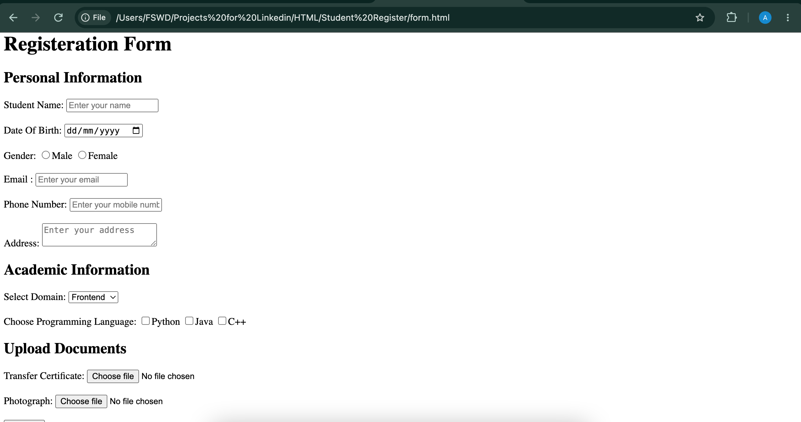

# Student Registration Form

A beginner-level student registration form created using HTML to practice different types of HTML form elements.

## 📌 About the Project

This project is a simple Student Registration Form created using HTML.

I created this project to understand how HTML forms work and to practice different form elements used to collect information from users.

## ✨ Features

* Student registration form
* Text input fields
* Email input
* Password input
* Radio buttons
* Checkboxes
* Dropdown/select options
* Text area
* Submit button
* Reset button

## 📸 Screenshots

### Home Page

### Registration Form

### About Page

### Contact Page

## 🛠️ Technologies Used

* HTML5

## 🎯 Purpose of the Project

The main purpose of this project is to practice:

* HTML forms
* Input elements
* Labels
* Radio buttons
* Checkboxes
* Select and option elements
* Textarea
* Submit and reset buttons
* Form structure

## 🚀 How to Run

1. Download or clone this repository.
2. Open the project folder.
3. Open the HTML file in a web browser.
4. Fill in the registration form and test the different form elements.

No additional installation is required.

## 🔗 GitHub Repository

[Student Registration Form](https://github.com/arivudurga835/HTML_Student_Registration_Form.git)

## 👨‍💻 Author

**Arivukkarasan J**

This project was created to practice HTML forms as part of my Web Development learning journey.
